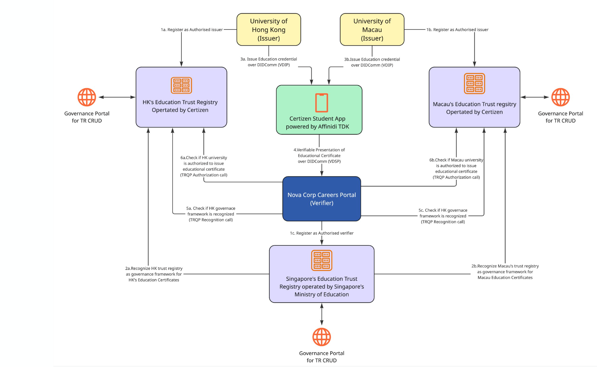
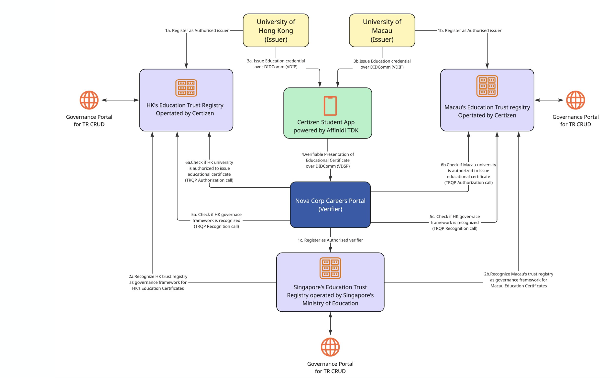
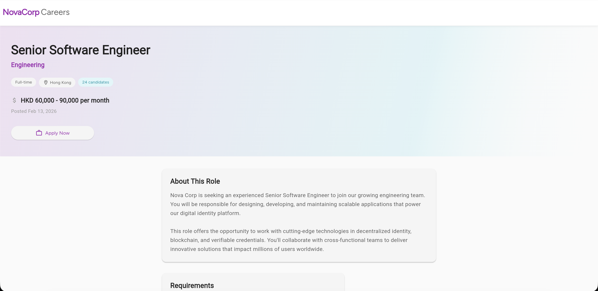
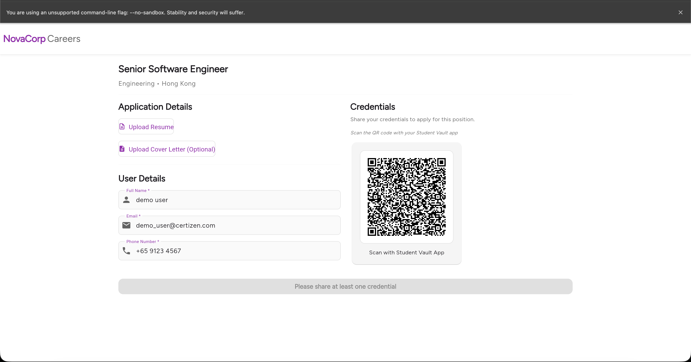

# Certizen - Cross‑Border Educational Credentials Verification

> Including Issuer Authorization & Trust Validation

An end‑to‑end reference implementation demonstrating how educational certificates can be issued, held, and verified using **W3C Verifiable Credentials**, with a focus on cross‑border issuer authorization and trust recognition.

> **⚠️ IMPORTANT: PROTOTYPE/REFERENCE IMPLEMENTATION**  
> This repository contains prototype applications and services developed for **demonstration and educational purposes only**. These are **not production-ready products** from Affinidi. This reference implementation showcases technical concepts and architectural patterns for verifiable credentials and should not be deployed in production environments without significant additional development, security hardening, thorough testing, and professional review.

---

## 📑 Table of Contents

- [Overview](#-overview)
- [Purpose](#-purpose)
- [Key Features](#-key-features)
- [Architecture](#️-architecture)
- [Demo Flow](#-demo-flow)
- [Quick Start](#-quick-start)
- [Project Structure](#-project-structure)
- [Components](#-components)
- [Technologies](#️-technologies)
- [Documentation](#-documentation)
- [Service Ports](#-service-ports)
- [Cleanup](#-cleanup)
- [License](#-license)

---

## 🎯 Overview

This repository showcases how trusted data ecosystems—especially in regulated markets like education—can evolve beyond traditional PKI-based infrastructures and interoperate with next‑generation decentralized trust technologies.

The demo illustrates a complete credential lifecycle: from **issuance** by universities, through **secure storage** in student wallets, to **verification** by employers across different jurisdictions—all while maintaining privacy, security, and cross-border trust.

---

## 💡 Purpose

Many trust service providers (such as Certizen in Hong Kong) have a strong foundation in PKI, digital certificates, and regulated identity issuance. They are also accredited to issue vLEI identities, which come with significant governance rigor and cross‑jurisdictional assurance.

However, the education sector introduces unique challenges:

- ✅ Credentials are **personal**, not organizational
- ✅ Issuers vary across **borders and regulatory systems**
- ✅ Students need **portable, interoperable proof**, not siloed PDFs
- ✅ Verifiers need to know whether a **foreign issuer is recognized and authorized**

This repository demonstrates how Affinidi's technology can **complement** (not replace) existing high‑assurance stacks by enabling trusted, privacy‑preserving, interoperable educational credential flows.

---

## ✨ Key Features

### 🎓 Credential Issuance

A trusted issuer (e.g., a university or education bureau) issues a **W3C Verifiable Credential** representing an educational certificate.

### 📱 Digital Wallet & Holder Flow

Students receive and securely store credentials in a **digital wallet** with full control over their data.

### 🔍 Multi-Layer Verification

Verifiers validate multiple aspects of the credential:

- ✅ **Authenticity** of the credential
- ✅ **Cryptographic signature** integrity
- ✅ **Status** (revoked or valid)
- ✅ **Issuer authorization** to issue that specific credential type

### 🌍 Cross‑Border Issuer Recognition

The system determines whether an issuer from another jurisdiction is:

- ✅ **Authorized** to issue the specific credential type
- ✅ **Recognized** within a relevant **trust registry**
- ✅ **Resolvable** through interoperable trust mechanisms

> **Why This Matters:** Traditional PKI infrastructures typically do not cover domain‑specific authorization for education issuers, particularly across borders.

---

## 🏗️ Architecture

```
Trust Registries (HK, Macau, SG)
        │
    ┌───┴───┐
Issuers     Verifiers
    │           │
    └─── Student ───┘
         Vault
```



The system consists of:

- **Trust Registries**: Maintain authorized issuer and verifier lists per jurisdiction
- **Issuers**: Universities that issue educational credentials
- **Student Vault**: Mobile app for credential storage and management
- **Verifiers**: Employers or institutions that verify credentials

---

## 🔄 Demo Flow

### Step 1: Trust Registry Setup

#### Register Issuers and Verifiers

- **University of Hong Kong (HKU)** → Registered as an authorized issuer in Hong Kong's Education Trust Registry
- **University of Macau (UM)** → Registered as an authorized issuer in Macau's Education Trust Registry
- **Nova Corp (Employer)** → Registered as an authorized verifier in Singapore's Education Trust Registry

#### Establish Governance Framework Recognition

- Singapore's Trust Registry **recognizes** Hong Kong's Education Trust Registry as a valid governance framework
- Singapore's Trust Registry **recognizes** Macau's Education Trust Registry as a valid governance framework

---

### Step 2: Credential Issuance

- **University of Hong Kong** issues an educational credential to the student via **DIDComm (VDIP) protocol**
- **University of Macau** issues an educational credential to the student via **DIDComm (VDIP) protocol**

---

### Step 3: Credential Verification

#### Presentation

The student uses the **Certizen Student App** (powered by **Affinidi TDK**) to present credentials to **Nova Corp** via **DIDComm (VDSP) protocol**.

#### Verification Process

Nova Corp performs the following checks:

1. **Governance Framework Recognition** (via TRQP Recognition calls)
   - Verifies Hong Kong's governance framework is recognized by Singapore's Trust Registry
   - Verifies Macau's governance framework is recognized by Singapore's Trust Registry

2. **Issuer Authorization** (via TRQP Authorization calls)
   - Confirms University of Hong Kong is authorized to issue educational certificates
   - Confirms University of Macau is authorized to issue educational certificates

---

## 🚀 Quick Start

### Prerequisites

#### System Requirements

- **RAM**: 8GB minimum (16GB recommended)
- **CPU**: 4 cores minimum
- **Disk**: 10GB free space

#### Required Software

- [Docker Desktop 4.0+](https://www.docker.com/products/docker-desktop) (installed and running)
- [ngrok account](https://dashboard.ngrok.com/signup) (free tier works)
- Flutter SDK 3.5.0+
- Dart SDK 3.5.0+
- Git

#### Configuration Requirements

- ngrok auth token
- Mediator DID
- Mediator URL
- Control plane DID (SERVICE_DID)

---

### Installation

#### 1. Start the Complete Environment

```bash
make dev-up
```

This command will:

1. ✅ Start ngrok tunnels for universities and education ministries
2. ✅ Capture dynamic ngrok domains
3. ✅ Generate all configurations and DIDs
4. ✅ Launch Docker containers (Trust Registries, Universities, etc.)

---

#### 2. Start Additional Services

After the environment setup completes, start the remaining services in separate terminals:

```bash
# Governance Portals
make hk-gov        # Hong Kong Governance Portal (port 8050)
make macau-gov     # Macau Governance Portal (port 8051)
make sg-gov        # Singapore Governance Portal (port 8052)

# Verifier Portal
make verifier      # Nova Corp Verifier (port 4000)

# Student App
make student-ios   # iOS simulator
# or
make student-android   # Android emulator
```

---

#### 3. Stop Services

```bash
make dev-down      # Stop ngrok tunnels and Docker services
make cleanup       # Complete cleanup (removes all data)
```

---

### 💡 Pro Tips

```bash
# View all available commands
make help

# Check Docker container status
make docker-ps

# View logs from all services
make docker-logs

# Rebuild and restart all Docker services
make docker-rebuild
```

---

## 📁 Project Structure

```
certizen-demo/
├── Makefile                          # All operation commands
├── README.md                         # This file
│
├── deployment/                       # Deployment configuration
│   ├── .env.ngrok                   # Environment config (auto-generated)
│   ├── .env.example                 # Environment template
│   ├── docker/                      # Docker compose files
│   │   ├── docker-compose.localhost.yml
│   │   └── docker-compose.yml
│   └── scripts/                     # Setup and utility scripts
│       ├── setup_ngrok.sh
│       └── cleanup.sh
│
├── governance-portal/               # Trust registry admin (Flutter Web)
├── student-vault-app/               # Student credential wallet (Flutter Mobile)
├── university-issuance-service/     # Credential issuance backend (Dart)
├── verifier-portal/                 # Credential verification (Dart)
├── trust-registry/                  # Trust registry service (Rust)
│
└── docs/                            # Documentation
    ├── architecture.md
    ├── setup.md
    ├── development.md
    └── ...
```

---

## 🧩 Components

| Component                        | Technology       | Description                               | Deployment |
| -------------------------------- | ---------------- | ----------------------------------------- | ---------- |
| **Student Vault App**            | Flutter (Mobile) | Credential storage and management         | Terminal   |
| **University Issuance Services** | Dart             | Credential issuance backends (HK & Macau) | Docker     |
| **Verifier Portal**              | Dart             | Employer credential verification          | Terminal   |
| **Governance Portal**            | Flutter (Web)    | Trust registry administration             | Terminal   |
| **Trust Registry**               | Rust             | Trust registry backend service            | Docker     |

---

## 🐳 Docker Services

The following services run in Docker containers:

| Service                      | Port | Description                              |
| ---------------------------- | ---- | ---------------------------------------- |
| **HK University Issuer**     | 3000 | University of Hong Kong issuance service |
| **Macau University Issuer**  | 3001 | University of Macau issuance service     |
| **HK Trust Registry**        | 3232 | Hong Kong education trust registry       |
| **Macau Trust Registry**     | 3233 | Macau education trust registry           |
| **Singapore Trust Registry** | 3234 | Singapore education trust registry       |

### Common Docker Commands

#### Using Makefile (Recommended)

```bash
make docker-ps          # Check container status
make docker-logs        # View all logs
make docker-stop        # Stop all services
make docker-rebuild     # Rebuild and restart
```

#### Using docker-compose Directly

```bash
# Navigate to deployment directory
cd deployment/docker

# Check container status
docker-compose -f docker-compose.localhost.yml ps

# View logs
docker-compose -f docker-compose.localhost.yml logs -f

# View specific service logs
docker logs hk-university-issuer -f
docker logs macau-university-issuer -f

# Restart services
docker-compose -f docker-compose.localhost.yml restart

# Stop and remove all containers
docker-compose -f docker-compose.localhost.yml down
```

---

## 🛠️ Technologies

| Technology                     | Purpose                                    |
| ------------------------------ | ------------------------------------------ |
| **Flutter**                    | Mobile & web UIs (Clean Architecture)      |
| **Dart**                       | Backend services (MVC pattern)             |
| **Rust**                       | High-performance trust registry API        |
| **Docker**                     | Container orchestration                    |
| **DIDComm v2**                 | Secure peer-to-peer communication protocol |
| **Riverpod**                   | State management for Flutter apps          |
| **W3C Verifiable Credentials** | Credential format standard                 |

---

## 📚 Documentation

### 🚀 Quick Guides

| Document                                   | Description                             |
| ------------------------------------------ | --------------------------------------- |
| [Quick Reference](docs/QUICK_REFERENCE.md) | Common commands and operations          |
| [Setup Guide](docs/setup.md)               | Detailed installation and configuration |
| [Troubleshooting](docs/troubleshooting.md) | Common issues and solutions             |

### 🏗️ Technical Documentation

| Document                                             | Description                              |
| ---------------------------------------------------- | ---------------------------------------- |
| [Architecture](docs/architecture.md)                 | System design and component interactions |
| [DIDComm Protocol](docs/didcomm-protocol.md)         | Protocol implementation details          |
| [Trust Registry](docs/trust-registry.md)             | Trust registry configuration             |
| [Development Guide](docs/development.md)             | Best practices and coding patterns       |
| [Git Workflow](docs/git-workflow.md)                 | Version control guidelines               |
| [Product Requirements](docs/product-requirements.md) | Project requirements and specifications  |

### 📦 Component Documentation

- [Governance Portal](governance-portal/README.md) - Trust registry administration
- [Student Vault App](student-vault-app/README.md) - Mobile wallet application
- [University Issuance Service](university-issuance-service/README.md) - Credential issuance
- [Verifier Portal](verifier-portal/README.md) - Credential verification

---

## 🔌 Service Ports

| Service                         | Port | Runtime  |
| ------------------------------- | ---- | -------- |
| **HK University Issuer**        | 3000 | Docker   |
| **Macau University Issuer**     | 3001 | Docker   |
| **HK Trust Registry**           | 3232 | Docker   |
| **Macau Trust Registry**        | 3233 | Docker   |
| **Singapore Trust Registry**    | 3234 | Docker   |
| **Nova Corp Verifier**          | 4000 | Terminal |
| **HK Governance Portal**        | 8050 | Terminal |
| **Macau Governance Portal**     | 8051 | Terminal |
| **Singapore Governance Portal** | 8052 | Terminal |

---

## 🧹 Cleanup

To completely remove all services and data:

```bash
make cleanup
```

This will:

- ✅ Stop all Docker containers
- ✅ Remove all Docker volumes and images
- ✅ Terminate ngrok tunnels
- ✅ Clean up generated configuration files

---

## 📖 Usage Guide

Once setup is complete and all services and applications are running, follow these instructions to execute an end-to-end issuance and verification flow.

### ✅ Issuers

Issuers are pre-configured for this demo and will use VDIP to issue credentials to students. All issuers have entries in their respective trust registries as authorized issuers.

**No additional configuration is required.**

---

### 🏛️ Configuring Trust Registries

If setup was successful, three trust registries and three governance portals are running—one for each jurisdiction (HK, Macau, SG).

**Required DIDs and URLs** can be found in the `dev-up` command logs or in `/deployment/.env.ngrok`.

#### Hong Kong Trust Registry

1. Open the Hong Kong governance portal: `http://localhost:8050/`
2. Enter a name for the registry
3. Skip the quick setup page
4. Add a record:

- **Entity ID**: HK University's DID
- **Authority ID**: HK Ministry's DID
- **Action**: `issue`
- **Resource**: `EducationCredential`
- **Trust Status**: `Authorized`

5. Click **Create Record** and verify the record appears in **Records**

#### Macau Trust Registry

1. Open the Macau governance portal: `http://localhost:8051/`
2. Enter a name for the registry
3. Skip the quick setup page
4. Add a record:

- **Entity ID**: Macau University's DID
- **Authority ID**: Macau Ministry's DID
- **Action**: `issue`
- **Resource**: `EducationCredential`
- **Trust Status**: `Authorized`

5. Click **Create record** and verify the record appears in **Records**

#### Singapore Trust Registry

1. Open the Singapore governance portal: `http://localhost:8052/`
2. Enter a name for the registry
3. Skip the quick setup page
4. Add two records:

   **Record 1** (HK Recognition):

- **Entity ID**: HK Ministry's DID
- **Authority ID**: SG Ministry's DID
- **Action**: `recognize`
- **Resource**: `listed-registry`
- **Trust Status**: `Recognized`

**Record 2** (Macau Recognition):

- **Entity ID**: Macau Ministry's DID
- **Authority ID**: SG Ministry's DID
- **Action**: `recognize`
- **Resource**: `listed-registry`
- **Trust Status**: `Recognized`

5. Click **Create Record** for each and verify both records appear in **Records**

**Example**: 

---

### 📱 Student App

1. Start your emulator or physical device:

```bash
make student-ios      # For iOS
# or
make student-android  # For Android
```

2. Complete the registration/login process. Note: OTP authentication is mocked; only specific email domains are allowed.
3. Complete your student profile (use matching details from the `make dev-up` setup)
4. When prompted to claim VCs, claim both credentials

**Example**:


---

### 🔍 Verifier App

1. Open the verifier portal: `http://localhost:4000/`
2. Browse the job listings
3. Click a job posting, then click **Apply** on the detail page
4. Note the pre-configured name and QR code
5. Scan the QR code using the Student App and follow the credential-sharing process
6. After successful credential sharing, the verifier validates the credential and trust registry status
7. Results appear below the application

**Repeat** as needed by deleting shared credentials or restarting from step 3.

|  |  |  |
| ------------------------------- | ------------------------------------- | ---------------------------------------- |

**Example**: [Watch the end-to-end credential sharing demo](docs/final-sharing.mov)

---

## 📄 License

See [LICENSE](LICENSE) and [NOTICE.txt](NOTICE.txt) for details.

---

## 🤝 Contributing

This is a reference implementation for demonstration purposes. For questions or suggestions, please open an issue.

---

## 🔗 Related Resources

- [Affinidi Documentation](https://docs.affinidi.com)
- [W3C Verifiable Credentials](https://www.w3.org/TR/vc-data-model/)
- [DIDComm Messaging](https://identity.foundation/didcomm-messaging/spec/)

---

<div align="center">

**Built with ❤️ by the Affinidi Team**

</div>
